# 👻 GhostShell: Hybrid Adaptive Honeypot

GhostShell is a next-generation high-interaction honeypot that combines the speed of a static system with the creativity of an LLM. It uses a **Go** "Muscle" for instant filesystem navigation and a **Python/Gemini** "Brain" to hallucinate realistic content and profile attackers in real-time.


## 🧠 Smart Hybrid Architecture

Unlike standard AI honeypots that lag on every command, GhostShell uses a **Split-Brain** architecture:

1.  **The Muscle (Go):** Handles "structural" commands (`cd`, `ls`, `pwd`) locally using an in-memory filesystem map. Response time: **<1ms**.
2.  **The Brain (Python):** Handles "content" commands (`cat`, `curl`, `mysql`). It uses a **Shadow Agent** to profile the attacker and dynamically generate bait.

```mermaid
sequenceDiagram
    participant H as 🕵️ Attacker
    participant M as 🛡️ Muscle (Go)
    participant B as 🧠 Brain (Python)
    
    H->>M: Connect via SSH (Port 2222)
    
    note over H,M: Phase 1: Structural (Instant)
    H->>M: "cd /etc"
    M->>M: Check Local Filesystem Map
    M->>H: Update Prompt (Instant)

    note over H,B: Phase 2: Intelligence (Adaptive)
    H->>M: "cat /var/log/auth.log"
    M->>B: HTTP POST {cwd, history, command}
    
    rect rgb(30, 30, 30)
        note right of B: 🕵️ Shadow Agent
        B->>B: Profile Attacker (Miner vs Spy)
        B->>B: Select Bait Strategy
        B->>B: Generate Hallucination
    end
    
    B->>M: Return Tailored Bait
    M->>H: Display Output
```



## ✨ Key Features

### ⚡ Instant Navigation
Uses a mapped `filesystem.go` structure to ensure commands like `ls -la`, `cd`, and `pwd` feel instantaneous, preventing the "AI Lag" that typically tips off hackers.

### 🕵️ Adaptive Profiling (Shadow Agent)
A background AI process analyzes the attacker's behavior to determine their intent:
* **Miner Detected?** -> The system spawns fake "NVIDIA A100" GPUs to keep them hooked.
* **Ransomware Detected?** -> The system generates a fake `/mnt/finance_backup` drive.
* **Spy Detected?** -> The system exposes fake `.ssh/config` files to track lateral movement attempts.

## 🚀 Quick Start (Local Dev)

**1. Start the Brain (Python)**
```bash
cd brain
pip install -r requirements.txt
# Set your Gemini API Key
export GEMINI_API_KEY="your_key_here"
python main.py
```

**2. Start the Muscle (Go)**
```bash
cd muscle
# Run both main and filesystem logic
go run .
```

**3. Get Hacked**
```bash
ssh -p 2222 root@localhost
```
